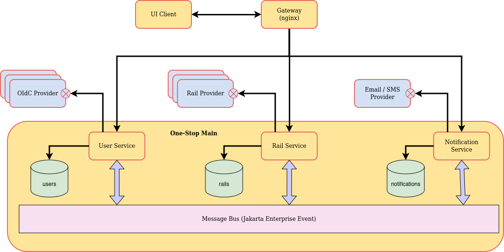

# One-Stop

---
A PoC for interacting with the Open-Banking APIs. Allows users connect to
their bank accounts and view the transactions from multiple accounts in an
aggregated fashion.

## Architecture
One-Stop has been designed using an event-driven, modulith service architecture,
where each service has a specific area of responsibility. However, to keep the
PoC build simple, the Maven model of parent POM and sub-modules has been
adopted; with each module adopting the same version as the parent.

An alternative implementation is presented in the "main" branch. That implementation
demonstrates how the same application can be built, and maintained, as a collection
of independent microservices.



### Structure
The project consists of a parent POM with a number of sub-modules. The sub-modules
consist of services (that provide client functionality) and libraries (that provide
internal functionality shared by services and other libraries).

In general, and to reduce clutter, the library modules are grouped under the parent
module `lib-module`. The exception to this is the event libraries; which are grouped
under the parent module `event-module`.

As much as possible, framework specific code (e.g. Quarkus) is kept to the outer
layers of the application. This is to allow the services to be easily ported to
other frameworks (e.g. Micronauts, Spring Boot). Where framework specific code has
been used, it's exposure to the rest of the application has been minimised. For
example; the repository classes are "masked" by a simple facade (or adaptor) class,
rather than exposing a framework specific repository interface.

#### Client
A simple browser UI, written in React, to demonstrate the back-end functionality.
One important aspect of this UI is the authentication. Requests are authenticated
by JWT tokens; signed by rotating private keys and passed in Secure, HTTP-Only,
Strict Same-Site cookies, without any intervention required by the UI. It also
demonstrates the use of XSRF tokens to protect against Cross-Site Request Forgery
attacks.

#### User Service
Responsible for on-boarding and managing internal user accounts. Provides OpenID
Connect authentication. Generates and renews JWT and XSRF tokens; signed with rotating
private keys.

#### Rail Service
Responsible for communicating with external banking rail services; managing and
downloading account information.

#### Notification Service
Responsible for issuing notifications to users and administrators; via email and
REST API. Generates email and notifications in the user's locale.

#### Audit Service
Responsible for recording audit events.

## Documentation
The majority of code contains in-line documentation, and most of the sub-modules
contain their own README.md file; intended to provide information specific to that
module.

Some sequence diagrams have been included, in the docs folder, to illustrate the
implementation of those more complex areas of the application. Also included is a
Postman collection to allow the manual testing of the application.

In addition to this documentation, comprehensive unit and integration tests provide
a good source of information on how the application is intended to be used.

## Docker Configuration
The following must be added to `environment:` section of the docker-compose.yaml
services. This can be also be achieved by creating a docker-compose-override.yaml.

### User Services
#### Cross-Site Request Forgery
Cross-Site Request Forgery (XSRF) is avoided by the transfer of a random token
generated using the configured XSRF secret (shared by all services).
```yaml
# the secret used to generate and verify the XSRF token
ONE_STOP_AUTH_XSRF_SECRET: "<any string value 18+ chars>"
```

#### OpenID Connect Auth Providers
The following OpenID Connect Auth Providers are supported, if fully configured:
- Google
- GitLab
- GitHub
- LinkedIn
- Apple

Their configuration consists, generally, of the client ID and secret you obtain
from them. This requires the registration of an "application"; which is often no
more than a configuration with your account.

Those Auth Providers for which the configuration properties are not provided cannot
be used for Open ID Connect authentication.
```yaml
# authenticate with Google Open-ID Connect
ONE_STOP_AUTH_OPENID_GOOGLE_CLIENT_ID: "<the client id issued by Google>"
ONE_STOP_AUTH_OPENID_GOOGLE_CLIENT_SECRET: "<the secret issued by Google>"

# authenticate with GitHub Open-ID Connect
ONE_STOP_AUTH_OPENID_GITHUB_CLIENT_ID: "<the client id issued by GitHub>"
ONE_STOP_AUTH_OPENID_GITHUB_CLIENT_SECRET: "<the secret issued by GitHub>"

# authenticate with GitLab Open-ID Connect
ONE_STOP_AUTH_OPENID_GITLAB_CLIENT_ID: "<the client id issued by GitLab>"
ONE_STOP_AUTH_OPENID_GITLAB_CLIENT_SECRET: "<the secret issued by GitLab>"

# authenticate with LinkedIn Open-ID Connect
ONE_STOP_AUTH_OPENID_LINKEDIN_CLIENT_ID: "<the client id issued by LinkedIn>"
ONE_STOP_AUTH_OPENID_LINKEDIN_CLIENT_SECRET: "<the secret issued by LinkedIn>"

# authenticate with Apple Open-ID Connect
ONE_STOP_AUTH_OPENID_APPLE_TEAM_ID: "<Team id issued by Apple>"
ONE_STOP_AUTH_OPENID_APPLE_CLIENT_ID: "<App client id issued by Apple>"
ONE_STOP_AUTH_OPENID_APPLE_KEY_ID: "<App key id issued by Apple>"

# the Private Key PEM used to sign data sent to Apple Open-ID Connect
ONE_STOP_AUTH_OPENID_APPLE_PRIVATE_KEY: "<the private key in PEM form>"
```

### Rail Service
The application relies upon the bank data provided by the Nordigen service
(now owned by GoCardless). Sign-up and access is free:
https://gocardless.com/bank-account-data/ 

The application also supports Yapily. Sandbox sign-up and access is free:
https://docs.yapily.com/
```yaml
# the Nordigen/GoCardless authentication keys
ONE_STOP_RAILS_SECRET_ID: "<the secret ID issued by Nordigen>"
ONE_STOP_RAILS_SECRET_KEY: "<the secret issue by Nordigen>"

# the Yapily authentication keys
ONE_STOP_YAPILY_SECRET_ID: "<the secret ID issued by Yapily>"
ONE_STOP_YAPILY_SECRET_KEY: "<the secret issue by Yapily>"
```

### Notification Service
In order to use the notification service, you will need to obtain an API key from
Brevo (previously known as Send-With-Blue). Sign-up and access is free:
https://www.brevo.com/
```yaml
# the Brevo (SendInBlue) Email-Service key
ONE_STOP_EMAIL_API_KEY: "<the secret issue by Brevo (previously Send-With-Blue)>"

# to disable the sending of emails - default false
ONE_STOP_EMAIL_DISABLED: "true"
```

## Gateway for 3rd Party Callbacks
The application uses the `ONE_STOP_GATEWAY_OPEN_PORT` to receive callbacks from
3rd party services. It is used by the Rails service to receive callbacks from
Nordigen/GoCardless and Yapily when obtaining users' consent to access their bank
details. It is also used by the User service to receive callbacks from OpenID
Connection Providers; e.g., Google, GitHub, GitLab and Apple.

This port must be open on the router to the outside world and forwarded to the
device IP and port on which the application is running. The application is able
to determine the IP address on which the router is listening (see the class
`com.hillayes.commons.net.Network`).
```yaml
# the http schema to use (http or https)
ONE_STOP_GATEWAY_SCHEME: "http"

# the port exposed on the router to the outside world
# used by callback from 3rd party services (e.g. rails)
ONE_STOP_GATEWAY_OPEN_PORT: "9876"
```

## To Build and Start Docker Images
### Build Parameters
By default, the build does not run unit-tests. To run the unit-tests, add
the following parameter to the build command:
```shell
mvn clean package -Ptest
```
By default, the client is not built. To build the client, add the following
parameter to the build command:
```shell
mvn clean package -Pclient
```

By default, the docker images use JVM base images. To build native docker
images, add the following parameter to the build command:
```shell
mvn clean package -Dnative
```
Combinations of these can be used.

### Building Client Docker Image
The client docker image is not built by the maven POM. To build the client create
a docker-compose-override.yaml and include the following - any existing docker
image should be deleted first:
```yaml
services:
  client:
    image: one-stop/client:1.0.0-SNAPSHOT
    build:
      context: ./client
```
Then run the build and start the docker images (with client image build):
```shell
mvn clean package -Pclient
docker compose up -d --build
```

#### Notes on Native Build for Arm64 / Aarch64
Building native images on Linux Intel (x86_64) is just a matter of using the
`-Dnative` build arg. Building native images for Arm64 or Aarch64 architectures
requires a little more effort. Here are the steps I've taken to achieve this:

Firstly, I'm using an Apple Mac M1 pro (a gift from a previous employer).
1. Install GraalVM JVM. I use `sdkman` to manage my Java installations:
   1. `sdk install java 21.0.2-graalce`
   2. Select the new installation as "default"
2. Set the environment property `GRAALVM_HOME` to locate the VM installation:
   1. `export GRAALVM_HOME=$HOME/.sdkman/candidates/java/21.0.2-graalce` 
3. You should now be able to build the native images using the command line:
   1. `mvn clean package -Dnative`

The POMs have been configured to set additional environment variables when
performing a native build on Aarch64 architecture. See the "arm64" profile in
the root `pom.xml`. Note, it is in this profile that the tag for the generated
container image is set.

## Debugging Docker Images
All non-native docker images are built with remote JVM debugging enabled. In
order to connect to the images the debug port 5005 must be exposed. Each
container should expose that internal port on a unique port - to avoid clashes.
```yaml
  one-stop-service:
    image: one-stop/one-stop-main:1.0.0-SNAPSHOT
    ports:
      - "8181:8080"
      - "5001:5005"
```

## Manually Pushing Docker Images to GitHub Repo
### login to GitHub repo
We need to login to our GitHub account using a Personal Access Token (classic). That
token can be created in
1. Go to your GitHub account settings
2. Navigate to Developer settings > Personal access tokens (https://github.com/settings/tokens)
3. Click on "Generate new token" and select "Generate new token (classic)"
4. Give the new token a "note" describing what it will be for
5. In the scopes, select the following
   1. write:packages
   2. delete:packages - if you will later want to use the token to delete
6. Click "Generate token"
7. Note the token ID - do it now, you won't be able to see it again 
```bash
docker login --username <username> --password <access-token-id> ghcr.io
```
### push image
```bash
docker push <fully-qualified-image-name>
```
The fully-qualified image name consists of the repo, username, image-name and tag.
For example; `ghcr.io/phillwatson/one-stop-user-service:1.0.0-SNAPSHOT`.
